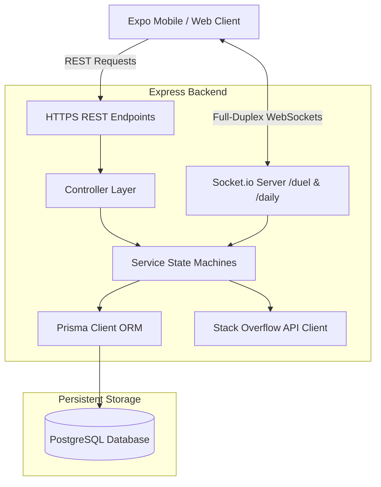
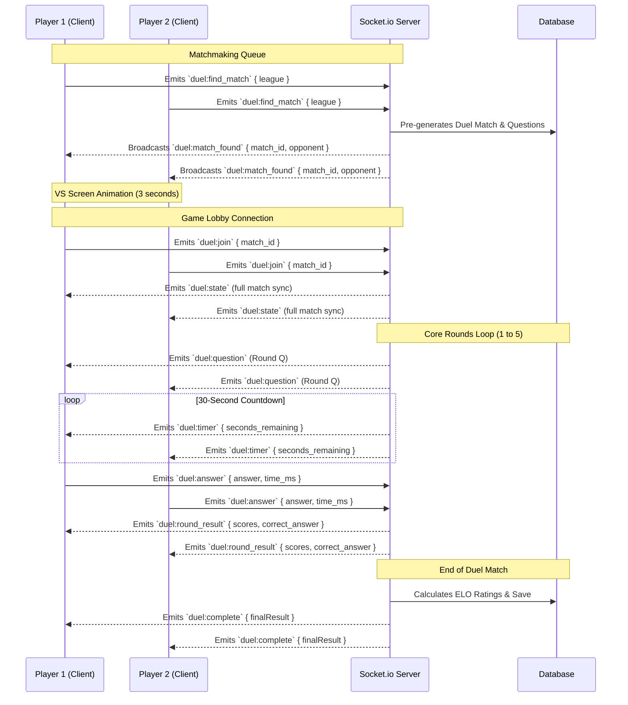

# ⚔️ StackQuest — Real-time Developer Trivia Arena

Welcome to **StackQuest**, a highly visual, gamified, real-time developer trivia arena where software engineering knowledge meets high-stakes competitive play! 

StackQuest transforms Stack Overflow questions, code snippets, and tech tags into interactive game modes. Challenge your friends in **1v1 Real-time Duels**, climb the matchmaking leagues, conquer the **Daily Coding Challenge**, or hone your skills in infinite **Puzzle Mode**. 

---

## 🚀 Key Features

*   **👾 1v1 Real-time Duels (`/duel`)**: Connect with opponents via Socket.io namespaces, answer synchronized rounds of programming trivia under pressure, and climb the competitive ladder.
*   **🧠 Fuzzy Evaluation Engine**: Supports multiple question types (Multiple Choice, Fill-in-the-Blank, and Free-form String answers) with intelligent keyword overlapping, substring matching, and Levenshtein distance calculations.
*   **🔥 High-Octane Streaks**: Level up your scores with golden streak multipliers for keeping correct answer combos alive.
*   **🏆 Competitive Matchmaking**: Queue and match with players of similar ELO across Bronze, Silver, Gold, Platinum, and Master leagues.
*   **📅 Daily Challenges (`/daily`)**: Compete in a fixed daily set of 10 trivia questions with ticking global countdown timers.
*   **📊 Rich Developer Profile**: Keep track of ELO, win rates, levels, achievements, friends list, and complete match histories.

---

## 🛠️ Monorepo Architecture

StackQuest is designed as a unified monorepo divided into two specialized workspaces:

```text
StackQuest Monorepo
 ├── backend/                        # Node.js + TypeScript Express Server & Socket.io
 │    ├── prisma/                    # Schema definitions & PostgreSQL migrations
 │    └── src/
 │         ├── app.ts                # Express app setup & middleware stack
 │         ├── server.ts             # Starts HTTP server & initiates cron jobs
 │         ├── config/               # Database & validated env variables
 │         ├── controllers/          # Route handlers (thin logic controllers)
 │         ├── services/             # Core business logic & state machines
 │         ├── routes/               # Express routers mapping to controllers
 │         ├── middleware/           # JWT authentication, validation, & rate limiting
 │         ├── socket/               # Realtime Duel & Daily namespaces
 │         └── utils/                # Pure game algorithms & evaluation scoring
 └── mobile/                         # React Native Expo Mobile/Web Client
      └── src/
           ├── app/                  # Expo Router File-System Navigation
           │    ├── (tabs)/          # Main tabs (duels, messages, profile, home)
           │    ├── auth/            # Auth screens (login, register, guest)
           │    └── game/            # Game screens (daily challenge, vs screen, duel gameplay)
           ├── components/           # Global notifications, duel invites, and custom UI components
           └── utils/                # HTTP API client wrappers & WebSocket managers
```

---

## 🏛️ System Design & Architecture

StackQuest is engineered around a real-time event-driven monorepo architecture, leveraging high-performance protocols to deliver lag-free, competitive gameplay.

### 1. Architectural Blueprint
The system coordinates data and events across decoupled HTTP REST and real-time state machines:



### 2. State Management & In-Memory Session Engines
To ensure instantaneous scoring feedback and keep database write cycles optimal, StackQuest implements a dual-tier state approach:
*   **In-Memory Game Sessions**: In-flight single-player sessions (Puzzle & Daily Modes) are driven by in-memory `Map<sessionId, ActiveSession>` buffers managed by the `GameService` state machine. This stores transient state (current answers, timing data, current streaks).
*   **Database Persistence**: When the player explicitly triggers a session end or finishes the daily sequence, cumulative statistics are aggregated, achievements are checked via the `AchievementService`, and persistent rows are committed to `game_sessions` and `leaderboard_entries` tables.
*   *Design Trade-off:* This provides ultra-low latency operations during gameplay. However, in-flight sessions are transient; a backend server reboot clears uncommitted in-memory states.

### 3. Real-Time Matchmaking & Race-Condition Protections
Multiplayer duels require strict real-time state consistency between opposing nodes:
*   **Queue Management**: The `MatchmakingService` operates an in-memory queue (`Map<string, QueueEntry[]>`) partitioned by league tiers (e.g. Bronze, Gold). When matching players are paired, a database `DuelMatch` record is instantly created, and players join the specific `/duel` room.
*   **Concurrency Guard (Double-Start Prevention)**: In high-concurrency systems, if both opposing clients emit `duel:join` simultaneously, race conditions could trigger duplicate database routines. The backend uses a synchronized `matchesStarted` memory Set. The first client thread to connect successfully adds the match ID to the Set and seeds the question pipeline; subsequent triggers observe the Set entry and skip redundant broadcasts.

### 4. Database Schema Directory
The data tier is backed by PostgreSQL, managed through Prisma ORM schemas. Key entities include:
*   **`users`**: Keeps persistent player credentials, lifetime XP, current level, competitive ELO, streak records, and matchmaking league ranks.
*   **`game_sessions`**: Chronicles completed single-player sessions (Puzzle and Daily Challenge) with overall score summaries and correctness details.
*   **`question_answers`**: Records every distinct answer attempt per session, linking to the question ID for telemetry and profile review.
*   **`so_question_cache`**: Local cache storing raw Stack Overflow questions to bypass public API rate limits.
*   **`duel_matches`**: Tracks 1v1 match timelines, current rounds, accumulated scores, ELO deltas, and final match outcomes.
*   **`duel_questions`**: Holds the pre-selected, randomized pool of questions designated for each individual duel match.
*   **`friendships`**: Manages relationships, status (pending, accepted), and blocks between players.

### 5. Stack Overflow Question Parser & Caching Pipeline
StackQuest uses real questions directly from developer communities:
1.  **Ingestion Service**: The `SoService` makes rate-limited, authenticated API calls to `api.stackexchange.com/2.3`, fetching highly upvoted questions with accepted answers.
2.  **Local Caching**: Incoming payloads are cached inside the `so_question_cache` table.
3.  **Parsing & Formatter**: The `questionFormatter.ts` utility strips raw HTML tags, formats markdown, decodes code snippets, and wraps them in clean code blocks. It then partitions questions into distinct categories:
    *   **Multiple Choice (`mcq`)**: Synthesizes the correct answer tag and selects three distractor tags from other cached questions.
    *   **Fill in the Blank (`fill_in_blank`)**: Blanks out the primary tag or central keyword with `___` markers.
    *   **Free String (`string_answer`)**: Serves the top accepted answer body, preparing keyword intersections for evaluation.
4.  **Cron Job Scheduler**: Node-cron jobs check the cache size daily. If the cache dips below configured limits, the ingestion service automatically pulls new questions.

---

## ⚙️ Core Gameplay & Scoring Algorithms (`stackquest.algorithm.ts`)

StackQuest handles scoring, player progression, evaluation, and competitive ELO calculation through deterministic, pure mathematical functions:

### 1. Intelligent Answer Evaluation
Depending on the question type, players receive similarity ratios that dictate correctness and reward points:
*   **Multiple Choice (MCQ)**: Case-insensitive exact match.
*   **Fill-in-the-Blank**: Matches exact strings, substring matches (awarding a partial $0.8$ ratio), or Levenshtein fuzzy distance matching (correctness threshold $\ge 0.70$).
*   **Free-form String Answer**: Computes keywords overlap against the reference answer (`|intersection| / |refWords|` $\ge 0.50$). Minimum length threshold of 10 characters ensures answer quality.

### 2. High-Octane Streak Scoring
Scores are computed using the formula:
$$\text{Total Score} = (\text{Base Points} + \text{Time Bonus}) \times \text{Streak Multiplier}$$

*   **Base Points**: MCQ = 20 | Fill-in-Blank = 25 | String Answer = 25 to 60 (based on overlap).
*   **Speed Time Bonus**: Up to $+10$ points based on completion speed (linearly decays to $0$ as the timer hits $30$ seconds).
*   **Streak Multiplier**:
    *   Streak $\ge 13$: **5x multiplier** 🔥
    *   Streak $\ge 10$: **3x multiplier**
    *   Streak $\ge 5$: **2x multiplier**
    *   Streak $< 5$: **1x multiplier**

### 3. Progression: Levels & Leagues
As players earn XP, they level up and move through leagues.
*   **Level Formula**: `Level = floor(sqrt(totalXP / 100)) + 1`
*   **Leagues (XP Thresholds)**:
    *   🥉 **Bronze**: $0$ XP
    *   🥈 **Silver**: $500$ XP
    *   🥇 **Gold**: $1,500$ XP
    *   💎 **Platinum**: $3,000$ XP
    *   👑 **Diamond**: $5,000$ XP
    *   🔮 **Master**: $8,000$ XP
    *   🌟 **Legend**: $12,000$ XP

### 4. Zero-Sum Competitive ELO
Duels use the standard Chess ELO rating system to reward beating stronger opponents (Chess $K$-factor $= 32$). The total ELO delta gained by a winner is directly deducted from the loser, maintaining a balanced ELO pool. Draws allocate ELO equally utilizing a $0.5$ game outcome value.

---

## 📡 REST API Route Directory

All protected routes require an `Authorization: Bearer <JWT_TOKEN>` header.

### 🔑 Authentication (`/api/auth`)
| Method | Path | Description | Body | Returns |
| :--- | :--- | :--- | :--- | :--- |
| `POST` | `/register` | Register a new user | `{ email, password, username? }` | `{ user, token, refreshToken }` |
| `POST` | `/login` | Authenticate existing user | `{ email, password }` | `{ user, token, refreshToken }` |
| `POST` | `/guest` | Play anonymously as guest | — | `{ user, token, refreshToken }` |
| `POST` | `/refresh` | Refresh expired JWT access token | `{ refreshToken }` | `{ token, refreshToken }` |
| `GET` | `/me` | Get current user's profile | — | User data row |
| `PATCH` | `/profile` | Update profile information | `{ username?, avatar_url?, bio? }` | Updated user row |

### 👥 Friend System (`/api/friends`)
| Method | Path | Description | Body |
| :--- | :--- | :--- | :--- |
| `GET` | `/` | List all accepted friends | — |
| `GET` | `/pending` | List pending friend requests | — |
| `POST` | `/request` | Send a new friend request | `{ username }` |
| `POST` | `/:id/accept` | Accept friend request | — |
| `POST` | `/:id/reject` | Reject/decline request | — |
| `DELETE`| `/:id` | Remove a friend | — |
| `POST` | `/:id/block` | Block user by ID | — |

### 🕹️ Single-Player & Session Game Modes (`/api/game`)
| Method | Path | Description | Body / Query |
| :--- | :--- | :--- | :--- |
| `POST` | `/puzzle/start` | Start single-player infinite Puzzle | `{ tag?, difficulty? }` |
| `POST` | `/daily/start` | Start fixed Daily Challenge | — |
| `GET` | `/daily/questions`| Get preloaded daily questions | — |
| `GET` | `/question` | Get next active puzzle question | `?session_id=&difficulty?` |
| `POST` | `/answer` | Submit and evaluate question answer | `{ session_id, question_id, question_type, player_choice?, player_answer?, time_taken_ms }` |
| `POST` | `/end` | End game session and update XP | `{ session_id }` |
| `GET` | `/categories` | Fetch list of popular trivia tags | — |

### 🏆 Leaderboards & Statistics (`/api/scores`)
| Method | Path | Description | Query Parameters |
| :--- | :--- | :--- | :--- |
| `GET` | `/leaderboard` | Get ranked leaderboard entries | `?period=all_time&mode=duel&tag=react` |
| `GET` | `/stats` | Get current user aggregated stats | — |
| `GET` | `/history` | Fetch past single-player sessions | `?limit=10&offset=0` |

---

## 🔌 WebSockets Event Protocol

StackQuest manages real-time duels and daily challenge timers via two high-performance namespaces in Socket.io:

### ⚔️ Namespace: `/duel`



#### Client Emits
1.  **`duel:find_match`**: Joins matchmaking lobby. `{ league: string }`
2.  **`duel:cancel_find`**: Exits matchmaking lobby.
3.  **`duel:join`**: Joins active duel socket room. `{ match_id: string }`
4.  **`duel:answer`**: Submits round answer. `{ round_number: number, answer: string, time_ms: number }`

#### Server Broadcasts
1.  **`duel:match_found`**: Triggers when matchmaking resolves. `{ match_id, opponent }`
2.  **`duel:state`**: Delivers the full match timeline and player information.
3.  **`duel:opponent_ready`**: Notifies that the rival joined the socket room.
4.  **`duel:question`**: Delivers current round's question payload. *(Correct answers are omitted to avoid client tampering).*
5.  **`duel:timer`**: Ticking countdown. `{ round_number, seconds_remaining }`
6.  **`duel:round_result`**: Outlines round results, correct answer, and current scores.
7.  **`duel:complete`**: Tally of final winner, overall scores, and ELO modifications.

---

### 📅 Namespace: `/daily`

Integrates real-time timer sync and rapid scoring metrics for the fixed daily challenge sequence.

#### Client Emits
1.  **`daily:join`**: Commences daily game sequence.
2.  **`daily:submit`**: Submits a daily answer. `{ question_number, answer, time_ms }`

#### Server Broadcasts
1.  **`daily:question`**: Transmits active daily question metadata.
2.  **`daily:timer`**: Ticking timer payload. `{ question_number, seconds_remaining }`
3.  **`daily:result`**: Evaluates submitted answer, awards XP/score, and sends feedback.
4.  **`daily:complete`**: Emits cumulative score and global leaderboard placement.

---

## ⚡ Connection Resilience & Stuck Guards

Multiplayer gameplay can be prone to intermittent networking drops. StackQuest incorporates several resilience guards on the client:
1.  **WebSocket Connect-State Guard**: The mobile client automatically checks if the socket has resolved (`socket.connected === true`) immediately when registering listeners, running queued events without getting stuck in a pending queue.
2.  **Match Resume Engine**: Reconnecting mid-game automatically grabs the current state from the database. It retrieves the active round, pre-filled questions, current user's submitted state, and timer to resume the duel without losing progress.
3.  **Visual Processing States**: Features elegant golden pulsing banners (`"✓ Answer submitted! Waiting for rival..."`) and glowing MCQ selections while waiting for opponents to complete their turn.

---

## 📦 Installation & Setup

### Database & Backend Setup

1.  **Prerequisites**: Install **Node.js (v18+)** and **PostgreSQL**.
2.  **Database Creation**:
    ```sql
    CREATE DATABASE stackquest;
    ```
3.  **Configure Environment**: Copy `backend/.env.example` into `backend/.env`:
    ```env
    DATABASE_URL="postgresql://<username>:<password>@localhost:5432/stackquest"
    JWT_SECRET="supersecretaccessjwtkey"
    JWT_REFRESH_SECRET="supersecretrefreshjwtkey"
    PORT=3000
    ```
4.  **Install & Deploy Schema**:
    ```bash
    cd backend
    npm install
    npm run db:push     # Pushes schema tables directly to PostgreSQL
    ```
5.  **Seed Database (Optional)**:
    If a seed script is provided, run `npx prisma db seed` to insert default badges and trophies.
6.  **Run Dev Server**:
    ```bash
    npm run dev
    ```
    *   Express + Socket.io Server: `http://localhost:3000`
    *   API Documentation: `http://localhost:3000/api/docs`

### Expo Mobile & Web Setup

1.  **Install Frontend Workspace**:
    ```bash
    cd mobile
    npm install
    ```
2.  **Configure Environment**: Configure server endpoints inside your `mobile/.env`:
    ```env
    EXPO_PUBLIC_API_URL="http://localhost:3000"
    ```
3.  **Launch Metro Bundler**:
    ```bash
    npx expo start
    ```
    *   Press **`a`** to load in Android Emulator.
    *   Press **`i`** to load in iOS Simulator.
    *   Press **`w`** to load in the Web browser.

---

## 🧪 Testing Suite

StackQuest is backed by automated tests verifying algorithms, REST paths, and WebSocket sequences.

### Running Unit Tests (Pure Logic)
Verifies mathematical scoring, Levenshtein distances, bag-of-words keyword overlaps, ELO balance, and level increments:
```bash
cd backend
npx ts-node --compiler-options '{"module":"commonjs"}' src/utils/__tests__/run_tests.ts
```

### Running E2E Integration Tests
Simulates full multi-user sessions (registration, guest login, matchmaking queues, real-time duels, socket timer expirations, and final ELO writes):
```bash
cd backend
npx ts-node --compiler-options '{"module":"commonjs"}' src/utils/__tests__/integration.test.ts
```

---

## 🛡️ Troubleshooting & Common Fixes

### 1. `Prisma Client not found` or `Query engine error`
This happens when the database schema has changed but the Prisma client was not regenerated:
```bash
cd backend
npx prisma generate
```

### 2. `WebSocket hangs` / `Matchmaker waiting indefinitely`
If you run inside simulated devices, verify that `EXPO_PUBLIC_API_URL` is pointing to your computer's local network IP (e.g. `http://192.168.1.XX:3000`) instead of `localhost`. Android and iOS simulators route `localhost` internally to the device itself.

### 3. `Neon Postgres adapter errors`
If running locally on a standard PostgreSQL engine instead of serverless Neon, ensure that standard pools are configured and the `Neon` adapter wrapper in `src/config/prisma.ts` is omitted or gracefully falling back.
