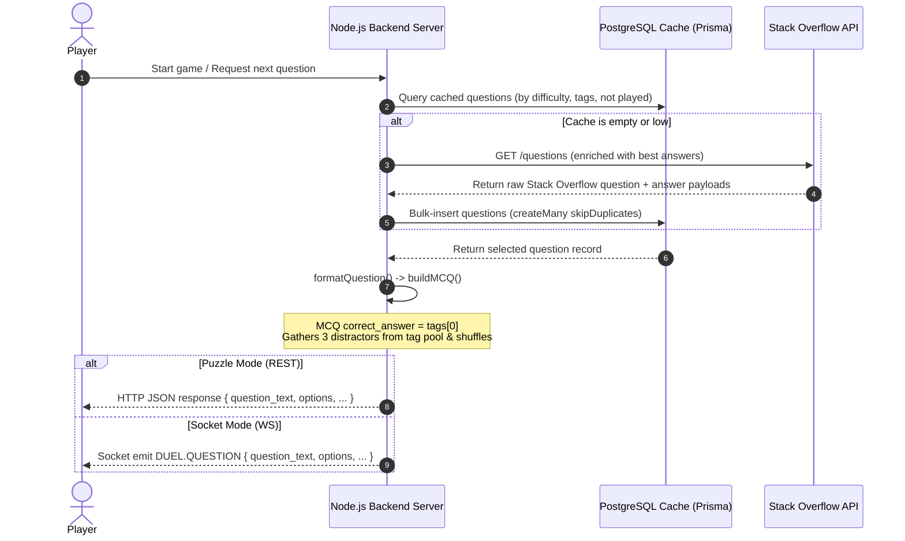

# StackQuest — Question System & Gameplay Architecture

This document provides an end-to-end, detailed technical breakdown of how StackQuest fetches questions from the Stack Overflow API, caches them in PostgreSQL, dynamically structures Multiple Choice (MCQ) templates, and serves them to players via HTTP/REST and WebSockets.

---

## 🗺️ System Pipeline & Data Flow

The following diagram illustrates the lifecycle of a question, from ingestion to real-time play:



---

## 🔌 1. Ingesting Questions from the Stack Overflow API
All Stack Overflow integration is managed inside `backend/src/services/so.service.ts`.

### Dynamic Ingestion Flow
1. **Fetching Questions (`fetchQuestions`):**
   * The server sends a `GET` request to the Stack Overflow API `/questions` endpoint.
   * It requests questions sorted by **upvote score** (`sort=votes`) to ensure high-quality, developer-curated material.
   * It uses a pre-created, custom SO API filter (`!6WPIomnJQl0me`) which explicitly returns the question ID, tags, title, body HTML, raw body markdown, accepted answer ID, and score.
2. **Efficient Answer Ingestion (`fetchAnswersBulk`):**
   * Making a round-trip HTTP request to SO for each individual question's answers is highly inefficient. 
   * To keep performance fast, the service batches up to 100 question IDs into a single semicolon-separated string (e.g. `123;456;789`) and makes a **single bulk API call** `/questions/{ids}/answers`.
   * It maps and pairs the "best" answer (favoring the *accepted* answer first, otherwise the highest upvoted answer) to each question ID.
3. **Response Caching:**
   * Raw SO responses are cached in-memory (`MemoryCache`) for a short duration (`CACHE_TTL_SECONDS`) using the request parameters as the cache key, preventing redundant API calls.

---

## 💾 2. Caching and Database Storage
The cache is managed inside `backend/src/services/question.service.ts`.

### Database Schema Mapping (`SoQuestionCache`)
* The raw API payload is normalized and written to the `so_question_cache` table in PostgreSQL.
* **Difficulty Mapping:** Difficulty is computed dynamically on ingestion:
  * **Easy:** Score $< 50$ upvotes.
  * **Medium:** Score between $50$ and $499$ upvotes.
  * **Hard:** Score $\ge 500$ upvotes.

### High-Throughput Bulk Caching (`cacheQuestions`)
* The backend takes the 100 enriched questions fetched from SO and inserts them into PostgreSQL in **one single roundtrip query** using:
  ```typescript
  await prisma.soQuestionCache.createMany({
    data: formattedList,
    skipDuplicates: true, // Inserts new questions; ignores ones already cached
  });
  ```
  This avoids database connection choking and is much faster than running 100 parallel `upsert` queries.

---

## 🎨 3. Dynamic MCQ Formatting
The conversion from a raw database model to an interactive game payload happens inside `backend/src/utils/questionFormatter.ts`.

When `gameService.evaluateAnswer` or the Socket handlers request a question, it runs `formatQuestion(question, 'mcq', pool)`:

### Option Generation
1. **Correct Answer Selection:**
   * The correct answer is defined as the primary tag of the Stack Overflow question: `correct_answer = question.tags[0]` (e.g., `"javascript"`).
2. **Dynamic Distractors (Wrong Answers) Generation:**
   * The builder looks at the pool of other questions loaded for the session.
   * It extracts tags from **other** questions that do not overlap with the current question's tags.
   * It selects **3 unique wrong tags** as distractors (e.g., `"python"`, `"c++"`, `"java"`). If the pool does not have enough unique tags, it pads them with fallback languages (like `"rust"`, `"go"`, `"php"`).
3. **Shuffling:**
   * The correct answer and the 3 distractors are merged and shuffled randomly so option $A, B, C, D$ layouts are completely unpredictable:
     ```typescript
     const options = shuffle([correct, ...distractors]).slice(0, 4);
     ```

### Text Sanitization & Formatting
* **Decoding Titles:** To prevent titles from displaying raw HTML symbols like `Can&#39;t`, it passes the title through `decodeEntities(...)` converting it into clean text (`Can't`).
* **Body Snippet Extraction:** It strips all HTML tags using regex, formats code blocks using triple backticks (` ``` `) to render nicely in code viewers, and clips the body excerpt to a safe sentence boundary (up to 350 characters) to ensure the player isn't overwhelmed with text.
* **Question Prompt:** The final text is combined:
  ```
  Which technology tag best describes this question?
  
  Title: [Clean Decoded Title]
  
  [Cleaned Body Excerpt]
  ```

---

## 📡 4. Serving Questions to the Client
The backend forwards questions using two distinct interfaces based on the game mode:

### Mode A: Solo Puzzle Mode (REST/HTTP Layer)
1. **Requesting (`game.controller.ts` -> `/api/game/question`):**
   * The client sends a `GET` request containing `session_id`.
   * The server validates the session in-memory (`activeSessions` map), pulls a random unused cached question, formats it using `buildMCQ()`, and sends the JSON response:
     ```json
     {
       "success": true,
       "data": {
         "question_type": "mcq",
         "question_text": "Which technology tag best describes...",
         "options": ["javascript", "python", "c++", "java"],
         "time_limit": 20,
         "question": { "question_id": 53949393, "title": "...", "tags": [...] }
       }
     }
     ```
2. **Submitting (`/api/game/answer`):**
   * The client posts `player_choice` (e.g. `"javascript"`) and `time_taken_ms` back to the server.
   * The service evaluates it against the cached correct tag (`tags[0]`), calculates the XP/Score (applying streak multipliers), records the answer in the DB, and returns:
     ```json
     {
       "success": true,
       "data": {
         "correct": true,
         "scoreEarned": 29,
         "correctAnswer": "javascript",
         "snapshot": { "score": 29, "streak": 1, ... }
       }
     }
     ```

---

### Mode B: Duel Mode & Daily Challenges (Synchronous WebSockets)
Socket services are managed in `backend/src/socket/duel.socket.ts` and `backend/src/socket/daily.socket.ts`.

1. **Synchronized Broadcast (`broadcastQuestion`):**
   * When the round starts, the server formats the round question and broadcasts it to both players in the room **at the exact same millisecond** via WebSockets:
     ```typescript
     namespace.to(`duel:${matchId}`).emit('duel:question', questionPayload);
     ```
   * The server initiates a repeating 1-second interval timer on the backend, emitting remaining time to synchronize client-side UI ticking clocks.
2. **Real-time Evaluation (`duel:answer`):**
   * Players emit `duel:answer` to the socket channel as soon as they select an option.
   * The backend processes the answer using `duelService.submitAnswer()` and returns a private acknowledgment (`duel:answer_ack`) to the individual player with their correctness and feedback.
   * **Immediate Round Complete:** The server checks the returned question state from memory. If **both** players have answered, the backend immediately clears the active round timer and broadcasts the round outcomes (`duel:round_result`) to everyone in the room.
3. **Closing a Match:**
   * After the final round result is displayed, the socket handler triggers `duelService.completeDuel()`.
   * The service parallel-reads both user objects, computes their final ELO changes, increments game stats, updates ELO win rates, and marks the match `'completed'` inside a single atomic Postgres database transaction.
