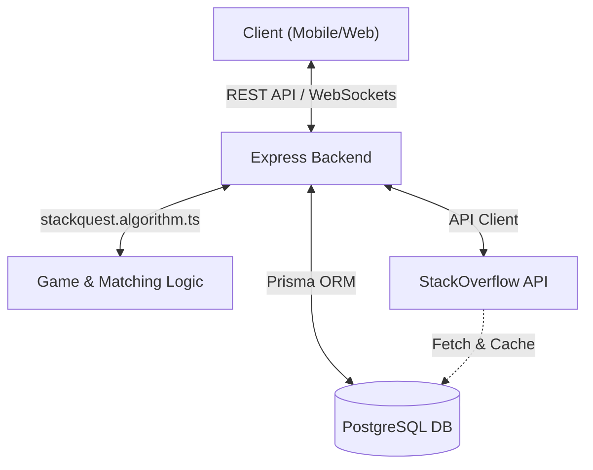
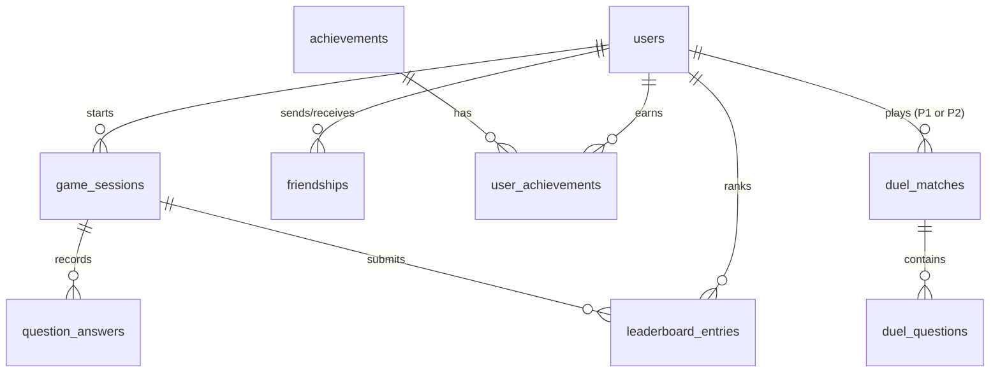
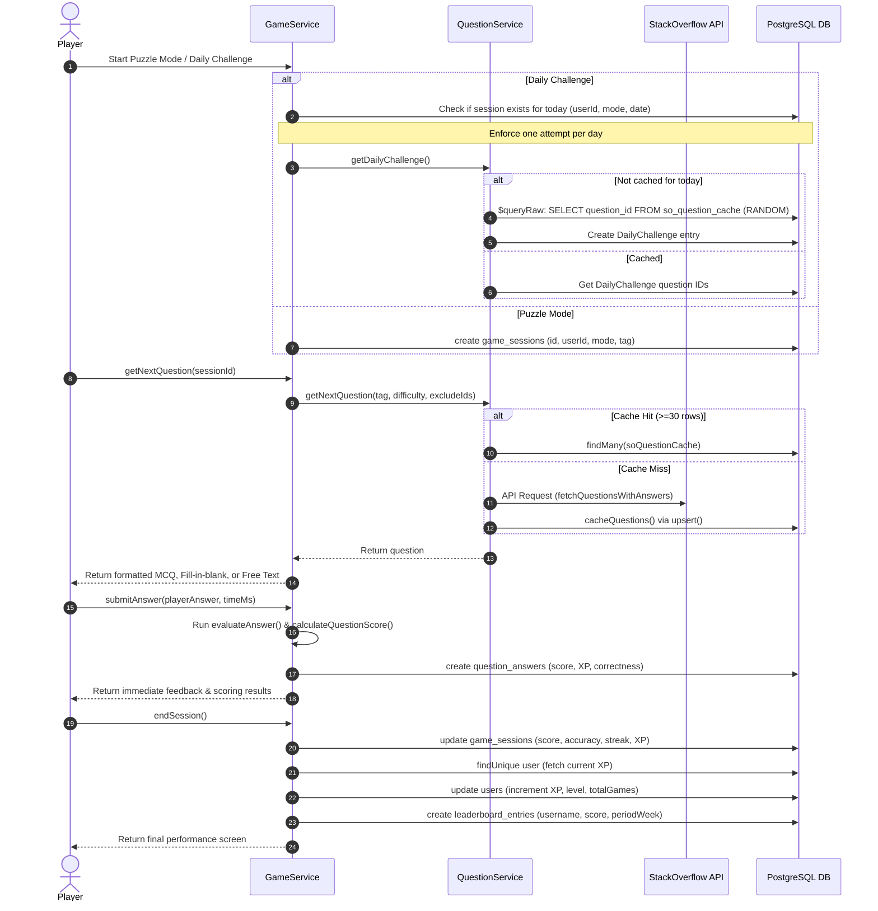
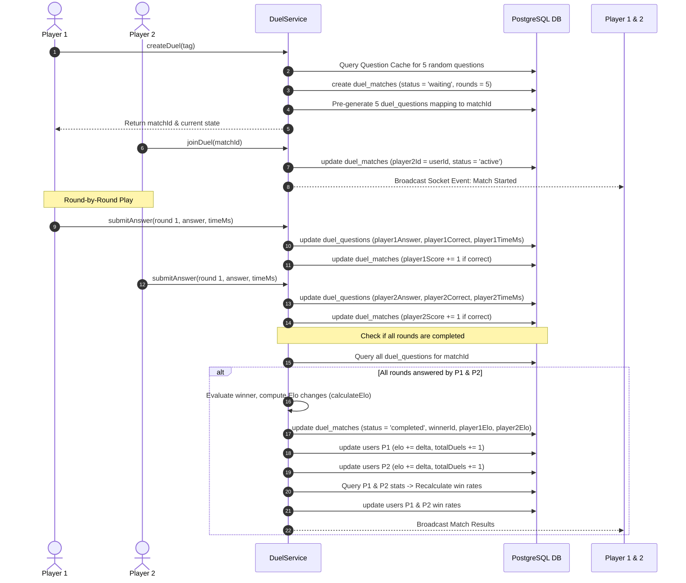

# StackQuest: Database Architecture, Flows, and Game Algorithms

This document provides a comprehensive, production-grade explanation of the **StackQuest** backend architecture, database schema, transactional data flows, and mathematical game algorithms. StackQuest is a gamified multiplayer platform centered around StackOverflow technical questions, offering Daily Challenges, Puzzles, and real-time head-to-head Duels.

---

## 1. Core Architecture & Tech Stack

StackQuest employs a high-performance, modular backend architecture:
*   **Database Engine:** PostgreSQL (leveraging advanced datatypes such as timezone-aware timestamps `TIMESTAMPTZ`, JSONB, and UUIDs for reliable data partitioning).
*   **ORM Layer:** Prisma ORM with generated clients and robust schema migrations.
*   **Caching & Third-Party Integration:** StackOverflow API client with local persistent caching via `SoQuestionCache` to minimize API latency and respect rate limits.
*   **Game Rules Engine:** Pure, deterministic TypeScript module (`stackquest.algorithm.ts`) managing scoring, ELO, XP, level scaling, and answers evaluation.



---

## 2. Database Entity Relationship (ER) & Schema Design

The PostgreSQL database contains 9 main relational entities, designed for high referential integrity, cascading deletes, and optimized query performance.



### Model-by-Model Specifications

#### A. Users (`users`)
Stores core player credentials, credentials-free guest indicators, matching stats (ELO), level/league progress, and session timestamps.
*   `id` (`UUID`, Primary Key): Generated using `uuid()`.
*   `username` (`VARCHAR`, Unique): Display name.
*   `email` (`VARCHAR`, Unique, Optional): For registered users.
*   `passwordHash` (`VARCHAR`, Optional): Encrypted credentials.
*   `isGuest` (`Boolean`): Defaults to `false`.
*   `elo` (`Int`): Duel ranking, defaults to `1000`.
*   `xp` (`Int`): Cumulative experience points, defaults to `0`.
*   `level` (`Int`): XP-scaled tier, defaults to `1`.
*   `league` (`Enum: League`): Bronze, Silver, Gold, Platinum, Diamond, Master, Legend.
*   `totalDuels` / `duelsWon` / `winRate` (`Int`, `Int`, `Float`): Historical records.
*   `currentStreak` / `maxStreak` (`Int`): Gamification metrics.
*   `createdAt` / `lastActive` (`TIMESTAMPTZ`): Tracking variables.

#### B. Friendships (`friendships`)
Manages social networks with pending, accepted, or blocked states.
*   `id` (`UUID`, PK).
*   `senderId` (`UUID` -> `users.id`, Cascade on Delete).
*   `receiverId` (`UUID` -> `users.id`, Cascade on Delete).
*   `status` (`Enum: FriendStatus`): `pending` | `accepted` | `blocked`.
*   *Constraint:* Unique index on `[senderId, receiverId]` prevents duplicate pairings.

#### C. Achievements (`achievements` & `user_achievements`)
Implements gamification systems based on arbitrary metrics stored inside JSON configurations.
*   `achievements`: Defines keys, descriptions, static badges (`icon`, `color`), and `criteria` (`JSON` rules engine).
*   `user_achievements`: Pivot table mapping `userId` and `achievementId` with an `unlockedAt` timestamp.

#### D. Duel Matches (`duel_matches`)
Tracks head-to-head 2-player sessions, status updates, round counts, and rating modifications.
*   `id` (`UUID`, PK).
*   `player1Id` (`UUID` -> `users.id`, Required).
*   `player2Id` (`UUID` -> `users.id`, Nullable until active/invited).
*   `winnerId` (`UUID`, Nullable until completion).
*   `player1Score` / `player2Score` (`Int`): Round points.
*   `player1Elo` / `player2Elo` (`Int`): Net rating changes (calculated upon completion).
*   `status` (`VARCHAR`): `waiting` | `invited` | `active` | `completed` | `cancelled`.
*   `rounds` (`Int`): Number of rounds, defaults to `5`.
*   `tag` (`VARCHAR`, Nullable): Focus language (e.g. `javascript`).

#### E. Duel Questions (`duel_questions`)
Pre-generated question sheets for a duel match to ensure both players see the identical set of questions, including choices, answers, and individual timing.
*   `id` (`UUID`, PK).
*   `matchId` (`UUID` -> `duel_matches.id`, Cascade on Delete).
*   `roundNumber` (`Int`): 1-indexed round sequence.
*   `soQuestionId` (`Int`): StackOverflow question ID reference.
*   `questionType` (`Enum: QuestionType`): `mcq` | `fill_in_blank` | `string_answer`.
*   `questionData` (`JSON`): Entire cached StackOverflow payload.
*   `correctAnswer` (`VARCHAR`): Reference answer.
*   `options` (`JSON`, Nullable): Generated distractors for Multiple Choice.
*   `player1Answer` / `player2Answer` (`VARCHAR`, Nullable): Submitted strings.
*   `player1Correct` / `player2Correct` (`Boolean`, Nullable): Correctness flags.
*   `player1TimeMs` / `player2TimeMs` (`Int`, Nullable): Duration taken.
*   *Constraint:* Unique combination of `[matchId, roundNumber]`.

#### F. Game Sessions (`game_sessions`)
Logs aggregate telemetry for single-player play (Daily Challenge and Puzzle modes).
*   `id` (`UUID`, PK).
*   `userId` (`UUID` -> `users.id`, SetNull on Delete).
*   `mode` (`Enum: GameMode`): `duel` | `daily_challenge` | `puzzle`.
*   `tag` (`VARCHAR`, Nullable): Subject tag.
*   `score` (`Int`): Session score.
*   `accuracy` (`Float`): Ratio of correct questions.
*   `streakPeak` (`Int`): Maximum consecutive correct answers.
*   `xpEarned` (`Int`): Total XP rewarded.
*   `dailyDate` (`DATE`, Nullable): Set to midnight UTC of active date to enforce single daily challenge.

#### G. Question Answers (`question_answers`)
Records granular responses for each question within a single-player `GameSession`.
*   `id` (`UUID`, PK).
*   `sessionId` (`UUID` -> `game_sessions.id`, Cascade on Delete).
*   `soQuestionId` (`Int`).
*   `questionType` (`Enum: QuestionType`).
*   `playerAnswer` / `playerChoice` (`VARCHAR`): Input text/choice.
*   `correct` (`Boolean`): Validity.
*   `scoreEarned` / `xpEarned` (`Int`): Points yielded.
*   `timeTakenMs` (`Int`).

#### H. StackOverflow Question Cache (`so_question_cache`)
A crucial performance layer. Prevents API rate limit exhaustion and shields players from external API timeouts by storing StackOverflow questions locally.
*   `questionId` (`Int`, PK): Original StackOverflow ID.
*   `title` / `body` / `bodyMarkdown` (`VARCHAR`): Structured content.
*   `tags` (`VARCHAR[]`): Associated tech tags.
*   `score` / `answerCount` / `viewCount` (`Int`): StackOverflow popularity indices.
*   `acceptedAnswerId` (`Int`, Nullable): Selected accepted answer ID.
*   `topAnswerBody` (`VARCHAR`, Nullable): Stored Markdown content of the highest-rated answer.
*   `topAnswerScore` / `topAnswerAuthor` (`Int`/`VARCHAR`, Nullable): Telemetry.
*   `difficulty` (`Enum: Difficulty`): `easy` | `medium` | `hard`.
*   `isAnswered` (`Boolean`).
*   `creationDate` (`TIMESTAMPTZ`): Original creation time on StackOverflow.
*   `lastFetched` (`TIMESTAMPTZ`): Last cached update timestamp.

#### I. Leaderboards (`leaderboard_entries`)
Consolidated performance ranking tables indexed by week and game mode.
*   `id` (`UUID`, PK).
*   `userId` / `sessionId` (`UUID`, Nullable).
*   `username` / `score` (`VARCHAR` / `Int`).
*   `mode` (`Enum: GameMode`).
*   `periodWeek` (`VARCHAR`): Stored as ISO-8601 week formats (e.g. `2026-W21`).

---

## 3. Core Architectural Flows & Lifecycles (Step-by-Step API / Database Operations)

### Flow A: Solo Game Session Lifecycle (Puzzle & Daily Challenge)

This section maps what happens in the database from the moment a player clicks "Start Solo Game" to "Game Over."



#### Step 1: Session Initialization
*   **Daily Challenge:**
    Checks if the user has already played today's challenge by querying UTC midnight:
    ```typescript
    const today = new Date(); today.setUTCHours(0, 0, 0, 0);
    const existing = await prisma.gameSession.findFirst({
      where: { userId, mode: 'daily_challenge', dailyDate: today },
    });
    ```
    If none is active, `QuestionService` fetches today's pre-selected questions (queries `DailyChallenge` table, or uses Postgres `ORDER BY RANDOM()` to generate 10 questions if not yet selected, then persists it).
*   **Puzzle Mode:**
    Directly spins up an in-memory `ActiveSession` state and writes a row in the database:
    ```typescript
    await prisma.gameSession.create({
      data: { id: sessionId, userId, mode: 'puzzle', tag },
    });
    ```

#### Step 2: Adaptive Question Fetching Cascade
When requesting a question, StackQuest executes a highly defensive cache lookup pattern to bypass external API rate limits:
1.  **Local Cache Scan:** Queries up to 30 candidates from `SoQuestionCache` that match the tag, difficulty, have a verified answer, and aren't in the player's session exclusion list (`excludeIds`):
    ```typescript
    const candidates = await prisma.soQuestionCache.findMany({
      where: {
        isAnswered: true,
        tags: { has: tag },
        difficulty,
        topAnswerBody: { not: null },
        questionId: { notIn: excludeIds }
      },
      take: 30,
      orderBy: { lastFetched: 'desc' }
    });
    ```
2.  **API Fallback:** If `candidates.length === 0` (a cold cache), the server fetches 100 questions from the StackOverflow API, filters for those with correct accepted answers, caches them asynchronously into the database using a bulk `upsert()` pipeline, and picks one.

#### Step 3: Granular Answer Recording
As the user answers each question, it is evaluated against the cached key in real-time. To prevent cheating or double-submitting, the system records each individual answer in the database:
```typescript
await prisma.questionAnswer.create({
  data: {
    sessionId,
    soQuestionId: questionId,
    questionType,
    playerAnswer,
    playerChoice,
    correct,
    scoreEarned,
    xpEarned,
    timeTakenMs,
  },
});
```

#### Step 4: Aggregation and Progression Updates
When the user finishes the session:
1.  The session's totals are calculated, and the `GameSession` row is updated:
    ```typescript
    await prisma.gameSession.update({
      where: { id: sessionId },
      data: { score, accuracy, streakPeak, questionsCount, correctCount, durationSecs, xpEarned },
    });
    ```
2.  The player's profile is fetched to get current XP, and incremented. The leveling logic (`calculateXPProgression`) checks if the user levelled up, updating the `User` table:
    ```typescript
    await prisma.user.update({
      where: { id: userId },
      data: { xp: newXp, level: newLevel, maxStreak: newMaxStreak, totalGames: { increment: 1 } },
    });
    ```
3.  A leaderboard entry is submitted for the current calendar week:
    ```typescript
    await prisma.leaderboardEntry.create({
      data: { sessionId, userId, username, score, mode, tag, periodWeek: "2026-W21" },
    });
    ```
4.  The session is purged from the backend server's active in-memory map.

---

### Flow B: 2-Player Duel Match Lifecycle (Real-time Competitive)

Competitive duels require a high degree of consistency. Since both players compete on the same questions, questions are pre-generated during matchmaking.



#### Step 1: Matching & Question Pre-Generation
When Player 1 initiates a duel:
1.  The system pulls 5 cached questions and creates a `DuelMatch` entry:
    ```typescript
    const match = await prisma.duelMatch.create({
      data: { player1Id: userId, player2Id: null, rounds: 5, tag, status: 'waiting' },
    });
    ```
2.  It iterates through these 5 questions, picks a game type (`mcq`, `fill_in_blank`, `string_answer`), computes the correct options, and populates the `duel_questions` mapping. This ensures database transactions remain rapid during game ticks:
    ```typescript
    await prisma.duelQuestion.create({
      data: {
        matchId: match.id,
        roundNumber: i + 1,
        soQuestionId: questions[i].question_id,
        questionType: qType,
        questionData: JSON.stringify(questions[i]),
        correctAnswer,
        options,
      },
    });
    ```

#### Step 2: Player 2 Joins
When Player 2 matching completes or they accept an invitation:
```typescript
await prisma.duelMatch.update({
  where: { id: matchId },
  data: { player2Id: userId, status: 'active' },
});
```
At this point, a WebSocket gateway broadcasts the start payload to both clients.

#### Step 3: Concurrency-Safe Round Submission
As players submit answers independently, the API modifies only their corresponding player columns inside `duel_questions` to prevent race conditions. The score is immediately updated:
```typescript
const updateData = isPlayer1
  ? { player1Answer: answer, player1Correct: correct, player1TimeMs: timeMs }
  : { player2Answer: answer, player2Correct: correct, player2TimeMs: timeMs };

await prisma.duelQuestion.update({ where: { id: duelQ.id }, data: updateData });

if (correct) {
  const scoreField = isPlayer1 ? 'player1Score' : 'player2Score';
  await prisma.duelMatch.update({
    where: { id: matchId },
    data: { [scoreField]: { increment: 1 } },
  });
}
```

#### Step 4: Zero-Sum ELO Settlement
Once every `roundNumber` row has non-null submissions for both players:
1.  The winner is determined by score. If scores are equal, the match is marked as a Draw.
2.  The backend pulls the current ELO ratings for both players and passes them to `calculateElo()`.
3.  The `DuelMatch` record is updated with rating delta values:
    ```typescript
    await prisma.duelMatch.update({
      where: { id: matchId },
      data: { status: 'completed', winnerId, completedAt: new Date(), player1Elo, player2Elo },
    });
    ```
4.  Both players' profiles are updated synchronously inside a transaction to increment ELO ratings, match counts, and recalculate win-rates:
    ```typescript
    await prisma.user.update({
      where: { id: match.player1Id },
      data: { elo: { increment: eloChange1 }, totalDuels: { increment: 1 }, duelsWon: { increment: p1Increment } }
    });
    ```

---

## 4. Deep Dive: The StackQuest Game Algorithms

The core mechanics of StackQuest are dictated by deterministic mathematical models implemented in `stackquest.algorithm.ts`.

---

### Algorithm A: The Multi-Format Answer Evaluator
Depending on the category, answers must be validated using distinct methodologies to support everything from simple clicks to syntax structures and open-ended text explanations.

#### 1. MCQ (Multiple Choice Questions)
*   **Methodology:** Exact, case-insensitive string comparison.
*   **Logic:**
    $$\text{isCorrect} = (\text{trim}(\text{Lowercase}(A_{\text{player}})) \equiv \text{trim}(\text{Lowercase}(A_{\text{correct}})))$$

#### 2. Fill in the Blank
Uses a highly robust three-tier cascade to evaluate syntactical answers fairly:
*   **Tier 1 (Exact):** Exact case-insensitive match ($A_{\text{player}} \equiv A_{\text{correct}}$). Yields a similarity ratio of $1.0$.
*   **Tier 2 (Substring):** Checks if the player's answer is a substring of the correct answer, or vice-versa. Yields a similarity ratio of $0.80$ and marks as correct.
*   **Tier 3 (Fuzzy Match):** Measures typographical edit distance using the Levenshtein distance metric. If the normalized similarity exceeds the threshold of $0.70$ ($70\%$), it is marked correct.

##### The Levenshtein Distance Algorithm
Given strings $s_1$ of length $m$ and $s_2$ of length $n$, the Levenshtein distance $D(i, j)$ is computed dynamically:

$$D(i, j) = \begin{cases}
  \max(i, j) & \text{if } \min(i, j) = 0, \\
  \min \begin{cases}
    D(i-1, j) + 1 \\
    D(i, j-1) + 1 \\
    D(i-1, j-1) + \text{cost}
  \end{cases} & \text{otherwise}
\end{cases}$$

Where $\text{cost} = 0$ if $s_1[i-1] \equiv s_2[j-1]$, else $1$.
The similarity ratio is calculated as:

$$\text{Similarity Ratio} = 1 - \frac{D(m, n)}{\max(\text{len}(s_1), \text{len}(s_2))}$$

*   **Threshold:** $\text{Similarity Ratio} \ge 0.70 \implies \text{Correct}$.

```typescript
function levenshteinSimilarity(a: string, b: string): number {
  if (a === b) return 1;
  const maxLen = Math.max(a.length, b.length);
  if (maxLen === 0) return 1;
  return 1 - levenshteinDistance(a, b) / maxLen;
}
```

#### 3. String / Free Text Answers
Designed for open-ended questions where players explain conceptual queries in programming. It uses a dynamic "Bag of Words" tokenizer and overlap keyword analysis.

*   **Safety Threshold:** If the input string is less than 10 characters, it is rejected immediately with a score of $0$ to prevent gaming the system.
*   **Tokenization Pipeline:**
    1. Force text to lowercase.
    2. Remove all non-alphanumeric characters (regex: `/[^a-z0-9\s]/g`).
    3. Split text by spaces and filter out blank elements.
    4. Store in a mathematical Set to isolate unique keywords.
*   **Intersection Formula:**
    $$\text{Overlap Ratio} = \frac{|T_{\text{player}} \cap T_{\text{correct}}|}{|T_{\text{correct}}|}$$
    Where $T$ represents the set of unique tokens.
*   **Threshold:** If $\text{Overlap Ratio} \ge 0.50$ (matching half of the core concepts in the reference answer), it is marked as correct.

---

### Algorithm B: Scoring & Dynamic Streaks
StackQuest rewards speed, consistency, and accuracy. Points are calculated on every question transaction.

#### The Scoring Formula
$$\text{Total Score} = \text{Round}\Big( \big( \text{BasePoints} + \text{TimeBonus} \big) \times \text{StreakMultiplier} \Big)$$

#### 1. Base Points (`BasePoints`)
Calculated based on difficulty and answer quality:
*   **MCQ:** $20$ points.
*   **Fill in the Blank:** $25$ points.
*   **String Answer:** Scaled proportionally according to the accuracy ratio:
    *   $\text{Similarity} \ge 85\% \implies 60$ points.
    *   $\text{Similarity} \ge 70\% \implies 40$ points.
    *   $\text{Similarity} \ge 50\% \implies 25$ points.
    *   $\text{Similarity} \ge 30\% \implies 10$ points.
    *   $\text{Similarity} < 30\% \implies 0$ points.

#### 2. Time Bonus (`TimeBonus`)
Players have up to 30 seconds ($30,000$ ms) to answer. Faster responses are rewarded:
$$\text{TimeBonus} = \text{Round}\left( 10 \times \max\left( 0, 1 - \frac{\text{TimeTakenMs}}{30,000} \right) \right)$$

*   *Example:* Answering in $7.5$ seconds ($7,500$ ms) yields:
    $$\text{TimeBonus} = 10 \times (1 - 0.25) = 7.5 \approx 8 \text{ points}.$$

#### 3. Streak Multipliers (`StreakMultiplier`)
Accumulating consecutive correct answers triggers a score multiplier:
| Active Streak ($S$) | Multiplier Value |
| :--- | :--- |
| $S \ge 13$ | **$5\times$** |
| $10 \le S < 13$ | **$3\times$** |
| $5 \le S < 10$ | **$2\times$** |
| $S < 5$ | **$1\times$** |

---

### Algorithm C: Solo XP, Levels, and Leagues
Solo mode progress is charted through levels and competitive leagues.

#### 1. XP Accumulation
*   MCQ / Fill in the Blank: $+10$ XP per correct answer.
*   String / Free Text: scaled by accuracy ($\text{Similarity Ratio} \times 20$ XP).
*   Session Entry: $+5$ XP just for starting, regardless of score.

#### 2. Level Formula
Level scaling is non-linear, requiring exponentially more XP as players rank up:
$$\text{Level} = \left\lfloor \sqrt{\frac{\text{XP}_{\text{total}}}{100}} \right\rfloor + 1$$

To reach Level $L$, the total XP requirement is:
$$\text{XP}_{\text{required}} = (L - 1)^2 \times 100$$

*   *Level 1:* $0$ XP
*   *Level 2:* $100$ XP
*   *Level 5:* $1,600$ XP
*   *Level 10:* $8,100$ XP

#### 3. League Progress Thresholds
Leagues are unlocked sequentially based on a player's total XP:

```mermaid
gantt
    title StackQuest League Thresholds (Total XP)
    dateFormat X
    axisFormat %s
    
    section Leagues
    Bronze (0 - 500 XP) :0, 500
    Silver (500 - 1.5k XP) :500, 1500
    Gold (1.5k - 3k XP) :1500, 3000
    Platinum (3k - 5k XP) :3000, 5000
    Diamond (5k - 8k XP) :5000, 8000
    Master (8k - 12k XP) :8000, 12000
    Legend (12k+ XP) :12000, 18000
```



---

### Algorithm D: Duel ELO Matchmaker & Zero-Sum Settlement
Duels use the standard Chess ELO rating system to evaluate a player's competitive rank.

#### 1. Expected Win Probability ($E$)
Before the match, the expected probability of victory is calculated based on ELO ratings:
$$E_1 = \frac{1}{1 + 10^{\frac{R_2 - R_1}{400}}}, \quad E_2 = \frac{1}{1 + 10^{\frac{R_1 - R_2}{400}}}$$

Where $R_1$ is Player 1's ELO and $R_2$ is Player 2's ELO.

#### 2. Rating Adjustment ($\Delta$)
Once the match concludes, new ELO ratings are updated using a K-Factor of $32$:
$$\Delta R_1 = \text{Round}\Big( K \times (S_1 - E_1) \Big)$$
$$\Delta R_2 = -\Delta R_1$$

Where the score ($S$) is defined by the match outcome:
*   $S = 1.0$ for a Win.
*   $S = 0.0$ for a Loss.
*   $S = 0.5$ for a Draw.

#### Step-by-Step ELO Computation Scenario
Let Player 1 ($R_1 = 1200$) face Player 2 ($R_2 = 1000$):
1.  **Expected Win Probability ($E_1$):**
    $$E_1 = \frac{1}{1 + 10^{\frac{1000 - 1200}{400}}} = \frac{1}{1 + 10^{-0.5}} \approx \frac{1}{1 + 0.3162} \approx 0.76$$
    *Player 1 has a $76\%$ expected probability of winning. Player 2 has an expected probability of $24\%$ ($0.24$).*
2.  **Case A: Player 1 Wins ($S_1 = 1.0$)**
    $$\Delta R_1 = 32 \times (1.0 - 0.76) = 32 \times 0.24 \approx +8 \text{ ELO}$$
    $$\Delta R_2 = -8 \text{ ELO}$$
    *New Ratings: Player 1 = $1208$, Player 2 = $992$.*
3.  **Case B: Player 2 Wins ($S_1 = 0.0$)**
    $$\Delta R_1 = 32 \times (0.0 - 0.76) = 32 \times (-0.76) \approx -24 \text{ ELO}$$
    $$\Delta R_2 = +24 \text{ ELO}$$
    *New Ratings: Player 1 = $1176$, Player 2 = $1024$. (A significant shift reflecting the upset).*
4.  **Case C: Match ends in a Draw ($S_1 = 0.5$)**
    $$\Delta R_1 = 32 \times (0.5 - 0.76) = 32 \times (-0.26) \approx -8 \text{ ELO}$$
    $$\Delta R_2 = +8 \text{ ELO}$$
    *Player 1 loses 8 ELO and Player 2 gains 8 ELO, as Player 2 held a lower expected rating.*

---

## 5. Architectural Database Flow Summary

To summarize the database interactions for different API calls, refer to the following cheat sheet:

| API Operation | HTTP Method / Event | Database Model(s) Mutated | Operation Type | Key Prisma Statement / Raw Query |
| :--- | :--- | :--- | :--- | :--- |
| **Start Puzzle Session** | `POST /api/game/start` | `GameSession` | Insert | `prisma.gameSession.create(...)` |
| **Get Next Question** | `GET /api/game/question` | `SoQuestionCache` | Read / Upsert | `prisma.soQuestionCache.findMany(...)` or `.upsert(...)` |
| **Submit Question Answer** | `POST /api/game/answer` | `QuestionAnswer` | Insert | `prisma.questionAnswer.create(...)` |
| **End Puzzle Session** | `POST /api/game/end` | `GameSession`, `User`, `LeaderboardEntry` | Transactional Update / Insert | `prisma.gameSession.update(...)` & `prisma.user.update(...)` & `prisma.leaderboardEntry.create(...)` |
| **Create Duel Match** | `POST /api/duels` | `DuelMatch`, `DuelQuestion` | Bulk Insert | `prisma.duelMatch.create(...)` & `prisma.duelQuestion.create(...)` in loop |
| **Join Match / Accept Invite** | `POST /api/duels/:id/join` | `DuelMatch` | Update | `prisma.duelMatch.update({ data: { player2Id, status: 'active' } })` |
| **Submit Duel Answer** | `POST /api/duels/:id/answer` | `DuelQuestion`, `DuelMatch` | Update | `prisma.duelQuestion.update(...)` & `prisma.duelMatch.update(...)` |
| **Resolve Duel Match** | WebSocket / Socket Trigger | `DuelMatch`, `User` | Multi-Row Transactional Update | `prisma.duelMatch.update({ status: 'completed' })` & `prisma.user.update(...)` (winRate recalculation) |
| **Calculate Category Stats** | `GET /api/questions/stats` | `SoQuestionCache` | Read (Aggregation) | `prisma.$queryRaw SELECT UNNEST(tags) AS tag, COUNT(*)...` |
| **Get Daily Challenge** | `GET /api/questions/daily` | `DailyChallenge`, `SoQuestionCache` | Read / Upsert | `prisma.dailyChallenge.findUnique(...)` or `.$queryRaw SELECT ... ORDER BY RANDOM()` |
