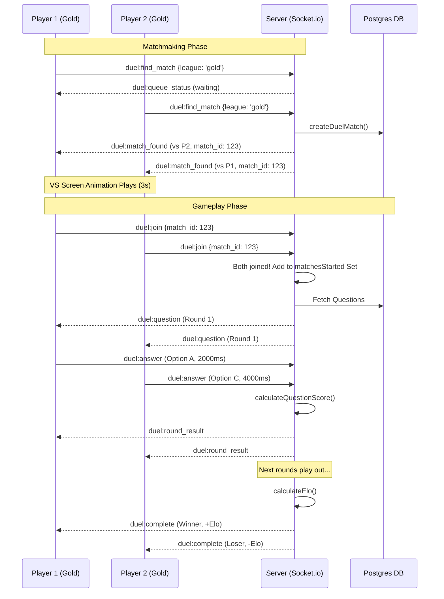

# StackQuest — Technical Architecture & Mechanics Guide

This document provides a comprehensive breakdown of how StackQuest's multiplayer Duels, scoring systems, and real-time mechanics are implemented across the mobile frontend and backend.

---

## 1. Core Game Algorithms (`stackquest.algorithm.ts`)

At the heart of the game is the `stackquest.algorithm.ts` file, a standalone module that handles all the mathematical calculations and text evaluation.

### Answer Evaluation Engine
The system supports three types of questions, each with its own evaluation strategy:

1. **Multiple Choice (MCQ)**
   - **Method:** Exact Match (Case-insensitive)
   - **Logic:** Both the player's answer and the correct answer are trimmed and converted to lowercase. If they are exactly the same, the player gets it right.

2. **Fill in the Blank**
   - **Method:** Three-tier Cascade (Exact → Substring → Fuzzy)
   - **Logic:**
     1. Exact match (100% correct).
     2. If one string contains the other (e.g., "react" vs "react native"), it awards 80% similarity.
     3. If it's a typo, it uses **Levenshtein Distance** (fuzzy matching). If the similarity ratio is $\ge 70\%$, it passes.

3. **String Answer (Free Text)**
   - **Method:** Bag-of-words Keyword Overlap
   - **Logic:** Discards punctuation, tokenizes words, and compares the player's vocabulary against the reference answer. If the overlap is $\ge 50\%$, it's marked correct. Answers under 10 characters immediately fail.

### The Scoring Formula
When a player answers correctly, their score is calculated using this formula:
**`Total Score = (Base Points + Time Bonus) × Streak Multiplier`**

- **Base Points:**
  - MCQ = 20 pts
  - Fill-in-the-blank = 25 pts
  - String Answer = scales between 10 and 60 based on similarity (how close the text was).
- **Time Bonus:** Max 10 points for an instant answer, scaling down to 0 points at the 30-second mark.
- **Streak Multiplier:** Consecutive correct answers build a multiplier:
  - $< 5$ streak: 1x
  - $\ge 5$ streak: 2x
  - $\ge 10$ streak: 3x
  - $\ge 13$ streak: 5x

### Progression: Levels & Leagues
As players earn XP, they level up and move through leagues.
- **Level Formula:** `floor(sqrt(totalXP / 100)) + 1`
- **Leagues:** Bronze (0 XP) $\to$ Silver (500) $\to$ Gold (1,500) $\to$ Platinum (3,000) $\to$ Diamond (5,000) $\to$ Master (8,000) $\to$ Legend (12,000).

### ELO Rating System (Duels)
Duels use the standard Chess ELO rating system to reward beating stronger opponents.
- **$K$-Factor:** 32 (controls how drastically ELO changes per game).
- If a 1000 ELO player beats a 1200 ELO player, the winner gains significantly more points than if they had beaten a 900 ELO player.

---

## 2. Backend Real-time Architecture (`duel.socket.ts`)

The backend uses `Socket.io` configured on the `/duel` namespace. It handles matchmaking and real-time state synchronization.

### League-based Matchmaking
1. When a player taps "Find Duel", the client emits `duel:find_match` with their current league.
2. The server maintains an in-memory queue (`Map<string, QueueEntry[]>`) keyed by the league name (e.g., `gold`).
3. If the queue for that league is empty, the player is added and waits.
4. If someone else is already waiting in that league, the server instantly removes them, creates a database `DuelMatch` record, and broadcasts `duel:match_found` to both players containing the opponent's stats.

### Race Condition Protections
A major challenge in WebSockets is when two players join a room at the exact same millisecond. 
If both players trigger the "Start Round 1" logic simultaneously, the server will accidentally broadcast the first question twice.

**The Fix:** The backend uses a `matchesStarted` Set. The exact moment the server verifies both players are in the room, it checks if `matchesStarted.has(match_id)`. The first player's connection adds the ID to the set and broadcasts the question; the second player's connection sees the ID is already in the set and skips the broadcast.

---

## 3. Mobile Frontend Implementation (`duel.jsx` & `vs-screen.jsx`)

The React Native mobile app orchestrates a dramatic, fluid transition from the lobby to the game.

### Phase 1: The Lobby (`duels.jsx`)
- The user taps "Find Opponent".
- The UI triggers expanding radar ripples and connects to the WebSocket.
- Once `duel:match_found` is received, it disconnects from the matchmaking queue and navigates to the VS Screen, passing the opponent's data and the `match_id` via router params.

### Phase 2: The VS Screen (`vs-screen.jsx`)
- A fighting-game-style animation plays. The two players "slam" into the center of the screen, creating screen shake, background flashes, and cracks.
- A "VS" and "FIGHT!" text overlay appears.
- After 3 seconds, the component automatically navigates to the actual gameplay screen (`duel.jsx`), passing the `match_id` forward.

### Phase 3: Gameplay (`duel.jsx`)
1. **Joining:** The client connects to `/duel` and emits `duel:join` with the `match_id`.
2. **Identity:** Because both players receive the exact same WebSocket events, the client checks the `duel:state` event to figure out if it is `player1` or `player2` based on its user ID.
3. **Timer & Questions:** The server emits `duel:timer` every second and `duel:question` to display the UI.
4. **Results:** When a round ends, the server emits `duel:round_result`. The client reads `player1_correct` or `player2_correct` depending on the identity established in Step 2. If correct, a confetti animation and combo streak UI trigger.
5. **Completion:** When the final round finishes, the server calculates ELO and emits `duel:complete`, which transitions the app to the results screen.

---

## 4. Full Flow Diagram

